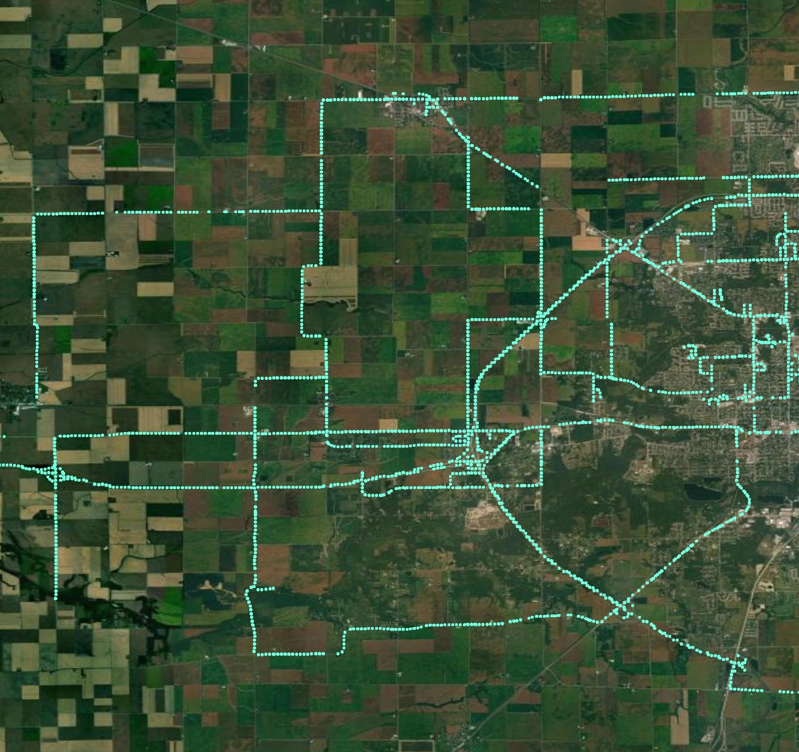
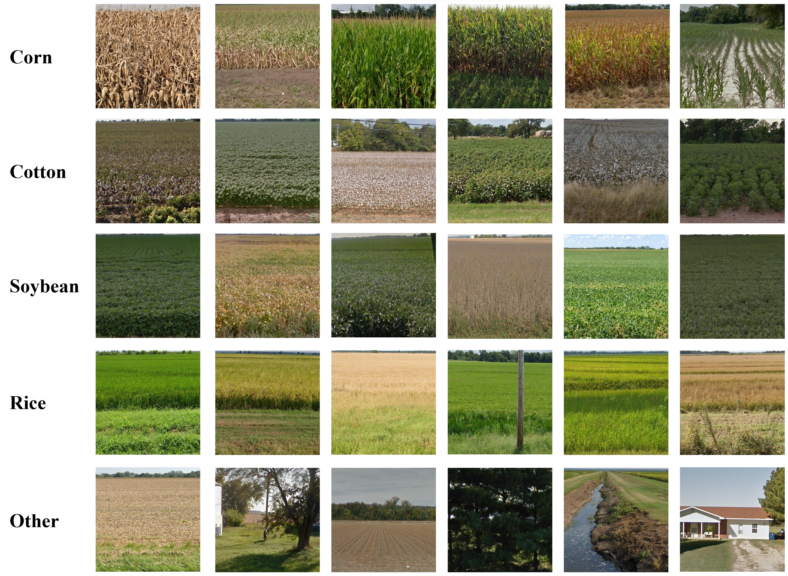
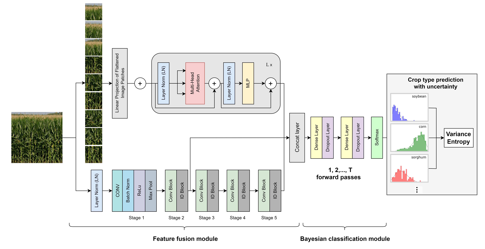

# CropSight: towards a large-scale operational framework for object-based crop type ground truth retrieval using street view and PlanetScope satellite imagery


## About

Collecting accurate ground truth data of crop types is a crucial challenge for agricultural research and development. The CropSight Framework is an open-source toolkit designed to automate the process of retrieving field-level crop type information from massive Google Street View (GSV) images. With its scalable and efficient features, the CropSight Framework enables the automatic identification of GSV images to generate in-situ crop-type labels over large areas.

The CropSight Framework supports the complete workflow of automatically retrieving ground truth labels of croplands, including GSV metadata collection, GSV panoramic image downloading and processing, and GSV image classification. This open-source toolkit aims to enhance agricultural development by collecting accurate ground truth data of crop types from open-source data sources. By using the CropSight Framework, researchers and practitioners across multiple disciplines can develop effective solutions for agriculture-related problems, such as crop classification and yield estimation.

This repository contains code for automatically generating crop type labels for agricultural parcels using Google Street View images. The CropSight framework will be tested in four study areas across the United States: Illinois, the South, Texas, and California. Location-specific deep learning models are developed to classify the dominant crop species in each study area. For instance, in the southern region of the United States, the dominant crop species include corn, soybean, rice, and cotton. The framework has been successfully tested for generating crop type labels in the southern region of the United States.


## Workflow of CropSight
<p align="center">
  
  <br>
  <b>CropSight Flowchart</b>
</p>
### 1. Operational cropland field-view imagery collection 
#### 1.1 Collect GSV metadata 

The [`collectGSV`](https://colab.research.google.com/drive/1WsbVxqH2A7FrLV7guVRx4HaEU6cwz2aJ#scrollTo=dxYrIqi1AmZG&line=1&uniqifier=1) function retrieves Google Street View (GSV) metadata using the `panoids = streetview.panoids(lat=x, lon=y)` line of code. The panorama IDs will be retrieved at a given location (lat and lon) if GSV images are available around the location. This metadata describes the IDs, location, orientation, and time of available GSV panoramas. 

```javascript
[{'panoid': 'E9DDnTQsKTcgpH9NHI6MaA', 'lat': 39.36998876974609, 'lon': -91.47946938753894, 'year': 2009, 'month': 3}, {'panoid': '17hKTtanmJahKVoRW2K25w', 'lat': 39.36997271381018, 'lon': -91.47946938753894, 'year': 2021, 'month': 12}, {'panoid': '3Tm5g6lPAjClKQEdQIqc5g', 'lat': 39.36984071070807, 'lon': -91.47946909232498}, {'panoid': 'brlitF-PRFlM4mK_VYbHFg', 'lat': 39.3701044774849, 'lon': -91.47946983035992}, {'panoid': 'piNgln2_TUk-iKbqTzNkzA', 'lat': 39.36957715579746, 'lon': -91.47947027318088}, {'panoid': 'KWthHUJiJvfeCRwLSqQaAA', 'lat': 39.36970869798013, 'lon': -91.47946953514592}, {'panoid': 'ASq1hW2FU34tsX8dsr5pYw', 'lat': 39.37023608736976, 'lon': -91.4794699041634}, {'panoid': 'eOPsj4WZYJABlikxXgazUQ', 'lat': 39.37036659341757, 'lon': -91.47946968275292}]
```

<p align="center">
  
  <br>
  <b>Avaiable GSV images.</b>
</p>

#### 1.2 Download GSV panoramic images 

After collecting the GSV metadata with the [`collectGSV`](https://colab.research.google.com/drive/1WsbVxqH2A7FrLV7guVRx4HaEU6cwz2aJ#scrollTo=dxYrIqi1AmZG&line=1&uniqifier=1) function, the corresponding GSV panoramic images can be downloaded using the [`downloadGSV`](https://colab.research.google.com/drive/1WsbVxqH2A7FrLV7guVRx4HaEU6cwz2aJ#scrollTo=VcIevQDJAnWq&line=53&uniqifier=1) function, which takes the panoid as input.

<p align="center">
  
  <br>
  <b>Sample of GSV panoramic image.</b>
</p>

#### 1.3 Extract roadside GSV Images
The [`NFOV`](https://colab.research.google.com/drive/1WsbVxqH2A7FrLV7guVRx4HaEU6cwz2aJ#scrollTo=s0kxmiukAnZx&line=1&uniqifier=1) class is used to extract two roadside street view images from each original GSV panoramic image. This function enables the extraction of a normal field of view centered on any point of the panorama. The implementation of the [`NFOV`](https://colab.research.google.com/drive/1WsbVxqH2A7FrLV7guVRx4HaEU6cwz2aJ#scrollTo=s0kxmiukAnZx&line=1&uniqifier=1) class is optimized for speed and efficiency, and it computes every pixel projection mapping at once. The function also uses bilinear interpolation to create smoother images, resulting in a more realistic and immersive viewing experience.

<p align="center">
  
  <br>
  <b>Extract two roadside images from GSV panoramic image.</b>
</p>

### 2. Training and test dataset preparation
Millions of GSV images are collected annually, capturing a wide range of scenes including buildings, houses, trees, and more. To collect representative GSV images of crop species from this massive dataset, the collected images are roughly labeled with the aid of the `Cropland Data Layer (CDL)` and then selected using a proposed `sampling` strategy. 

#### 2.1 Label roadside GSV images
The CDL is a geospatial dataset created by the United States Department of Agriculture (USDA) that provides information on the types of crops grown on agricultural lands in the United States, including grains, oilseeds, cotton, fruits, vegetables, and hay. By using the specific location of each GSV point, the percentage of crop species that corresponds to each GSV image is estimated based on the CDL data and the orientation information when the panoramic GSV images were taken. Only GSV images that correspond to a single crop species are assigned a label.

#### 2.2 Sample representative roadside GSV images
The GSV images with crop species labels are sampled using the function `sampling`, which selects representative images over the entire study area. This process ensures that the selected GSV images are evenly distributed across the study area. The input variables for the function include the GSV point shapefile that needs to be sampled (e.g., high-quality cropland GSV points), the administrative boundaries shapefile (e.g., county boundaries), and the target number of sampled GSV images. The road network, including notes and primary roads, is obtained from the OpenStreetMap database and used to remove low-quality GSV images.

The sampling strategy employed is a dynamic sampling method that adapts to the number of available GSV images. For each administrative district, a FishNet is created and dynamically adjusted until the final number of sampled GSV images matches the target number. This sampling strategy can also be used to randomly select an application dataset for collecting ground truth crop type data in the future.

#### 2.3 Automated roadside GSV image enhancement
Training a deep learning model with GSV images that are 2000 x 2000 pixels requires significant computational resources. To make the training process feasible while retaining the necessary details of the images (such as plant leaves), a `zoom-in` strategy has been developed. This strategy involves automatically clipping patches of the field from the larger GSV images. To accomplish this, the Canny Edge Detection algorithm is used to identify the edges of any plants present in the GSV images and to locate the boundary between the field and the sky. Once the horizontal boundary line has been identified, the images are further clipped to extract the critical patch corresponding to the view of the field.

<p align="center">
  
  <br>
  <b>Automatically extract the target patch from roadside images.</b>
</p>

#### 2.4 Relabel roadside GSV images by visual interpretation

GSV images may contain other plant or blocking items that can interfere with distinguishing the crop view on the image. Furthermore, the CDL-generated labels for each GSV image may contain errors due to misclassifications. To address these issues, each image undergoes visual interpretation and is further labeled accordingly. Images containing other items or with crops that are difficult to distinguish are labeled as "others." The following shows the final processed dataset of dominant crop species for the southern region of the United States.

<p align="center">
  
  <br>
  <b>Crop type ground-level view dataset. </b>
</p>

### 3. GSV images classification 
#### 3.1 Proposed deep learning model (ViTResFusionNet)

<p align="center">
  
  <br>
  <b>ViTResFusionNet Architecture. </b>
</p>

[`ViTResFusionNet`](https://colab.research.google.com/drive/1WsbVxqH2A7FrLV7guVRx4HaEU6cwz2aJ#scrollTo=jKrbgacr025T&line=18&uniqifier=1) is a deep learning model designed for classifying crop species in street view images. It combines the features extracted from two state-of-the-art image classification architectures, Vision Transformer and Residual Neural Network, and fuses them for classification. The model also incorporates MC Dropout in the classification layer to provide uncertainty estimates for each image classification in addition to the probability of each class.  


#### 3.2 Benchmarks 
The performance comparison of two state-of-the-art image classification architectures, Vision Transformer and Residual Neural Network, is evaluated using the same training and testing datasets. 

<div align="center">

<table>
    <thead>
        <tr>
            <th align="center">DL model</th>
            <th align="center">Precision</th>
            <th align="center">Recall</th>
            <th align="center">F-measure</th>
            <th align="center">Accuracy</th>
        </tr>
    </thead>
    <tbody>
        <tr>
            <td align="left">ViT</td>
            <td align="center">0.9036</td>
            <td align="center">0.9021</td>
            <td align="center">0.8993</td>
            <td align="center">0.9021</td>
        </tr>
        <tr>
            <td align="left">ResNet50</td>
            <td align="center">0.9243</td>
            <td align="center">0.9212</td>
            <td align="center">0.9218</td>
            <td align="center">0.9212</td>
        </tr>
         <tr>
            <th align="left">ViTResFusionNet</th>
            <th align="center">0.9595</th>
            <th align="center">0.9593</th>
            <th align="center">0.9592</th>
            <th align="center">0.9593</th>
        </tr>
    </tbody>
</table>

</div>

### 4. Application in reality

This part is currently under development. We are actively working on it.

## Author
Yin Liu (yinl3@illinois.edu)

Chunyuan Diao (chunyuan@illinois.edu)

[Remote Sensing Space-Time Innovation Lab](https://diaorssilab.web.illinois.edu/)

Department of Geography & GIScience, University of Illinois at Urbana-Champaign


## Acknowledgement
This project is supported by the National Science Foundation’s Office of Advanced Cyberinfrastructure under grant 2048068.


