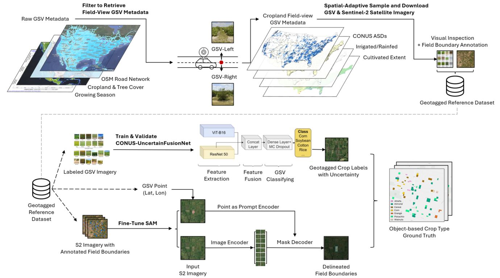
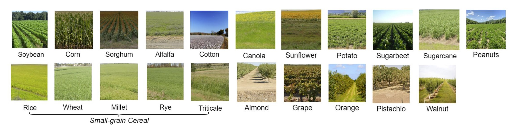

# [CropSight: towards a large-scale operational framework for object-based crop type ground truth retrieval using street view and PlanetScope satellite imagery](https://www.sciencedirect.com/science/article/pii/S0924271624002922)

## Introduction

Collecting accurate ground truth data of crop types is a crucial challenge for agricultural research and development. The CropSight Framework is an open-source toolkit designed to automate the retrieval of object-based crop type information from massive Google Street View (GSV) images. With its scalable and efficient features, CropSight enables the automatic identification of GSV images and boundary delineation to generate in-situ object-based crop-type labels over large areas.

### Key Components
- **Large-Scale Operational Cropland Field-View Imagery Collection Method**: Systematically acquires representative geotagged cropland field-view images.
- **Uncertainty-Aware Crop Type Image Classification Model (UncertainFusionNet)**: Retrieves high-quality crop type labels with quantified uncertainty.
- **Cropland Boundary Delineation Model (SAM)**: Delineates cropland boundaries using PlanetScope satellite imagery.

## Workflow

<p align="center">
  
  <br>
  <b> Figure 1: CropSight Flowchart. </b>
</p>

## Dataset 
- ### UncertainFusionNet  
<p align="center">

<br>
<b> Figure 2: Crop type ground-level view dataset (CropGSV) used to train UncertainFusionNet. </b>
</p>

- ### SAM
<p align="center">

<br>
<b> Figure 3: Cropland boundary ground-truth dataset (CropBoundary) used to fine-tune SAM. </b>
</p>

## Application 

Using the CropSight framework, we collected crop type ground truth data from Google Street View and PlanetScope satellite imagery. Below are examples of the application of CropSight in the US and Brazil.

- ### Example 1: Brazil

<p align="center">
  
  <br>
  <b>Figure 4: Object-based crop type ground truth map produced by CropSight using the latest images (2023) in Brazil. Crop type labels are overlaid on Google Earth imagery. The accuracy of crop type classification and boundary delineation is assessed by randomly sampling and comparing against visually interpreted GSV-based ground truth data.</b>
</p>

- ### Example 2: United States

<p align="center">
  
  <br>
  <b>Figure 5: Object-based crop type ground truth maps produced by CropSight using the latest images (2023). These maps represent four distinct study areas in the United States (A-D). (a) Overlay of crop type labels on Google Maps. (b) Overlay of crop type labels on off-season PlanetScope images.</b>
</p>


## Example of Retrieving One Ground Truth

To see an example of how to retrieve one ground truth using the CropSight framework, refer to the [CropSight.ipynb](https://colab.research.google.com/drive/1yoTC0MrmTVOrDZNF7A7rNcK-XbthJ1Ub?usp=drive_link).

## CropSight-US: A National-Scale Object-based Crop Type Ground Truth Dataset

CropSight-US is an annual, object-based crop type ground truth dataset covering the contiguous United States (CONUS) from 2013 to 2023. Based on the CropSight workflow (Liu et al., 2024), it expands sample generation from specific sites to nationwide coverage, labeling 17 distinct crop types. The dataset integrates Google Street View imagery for crop type identification and Sentinel-2 imagery for field boundary delineation, addressing the challenge of large-scale ground truth data collection. To our knowledge, CropSight-US is the first nationwide, object-based crop type dataset derived from street view imagery, offering broad spatial and crop-type coverage.

CropSight-US is in its final stages of preparation and will be released soon as an open-source dataset.

<p align="center">
  
  <br>
  <b>Figure 6: CropSight-US ground-truthing framework demonstrating the steps necessary to generate the CropSight-US products across CONUS for object-based crop type ground truth building on the CropSight by Liu et al. (2024).</b>
</p>

To generate the CropSight-US dataset, we apply our crop type ground truthing framework across the entire CONUS using an automated pipeline. This pipeline processes all available cropland field-view GSV metadata from 2013 to 2023 to ensure broad spatial coverage and capture agricultural diversity.

Since GSV panoramas are captured approximately every 10 meters, multiple metadata records may correspond to the same field. To reduce redundancy, we spatially link each GSV metadata record to cropland field boundaries from the CSB dataset and randomly select one representative per field to ensure spatial uniqueness.

To guide crop-type sampling, we quantify the spatial distribution of each crop by counting retained GSV metadata linked to CSB-labeled fields. We compute the average metadata count per ASD per crop type to establish a baseline for balanced representation, accounting for crop extent, GSV availability, and irrigation practices.

For each crop-year combination:

- In ASDs with fewer samples than the baseline, all metadata are retained.
- In ASDs exceeding the baseline, we retain the baseline plus a proportionally sampled subset based on CSB-linked metadata volume.
- To preserve irrigation representation, we stratify samples by irrigation status within each ASD, maintaining the relative proportions of irrigated and non-irrigated fields.

Using these ASD-level targets, we apply a spatially adapted sampling strategy (Sect. 3.1.2) to select cropland field-view GSV records. Each selected record is paired with:

- The corresponding GSV image
- The least cloudy Sentinel-2 image from the same month (or NAIP as fallback)
- Crop type labels are predicted using CONUS-UncertainFusionNet, which also provides uncertainty metrics. Field boundaries are delineated using our fine-tuned SAM model.

Each entry in the CropSight-US dataset includes:

- Predicted crop type
- Confidence metrics (entropy, variance, confidence level)
- Delineated field boundary
- Year and month of GSV capture

More information about sampling is documented at [CropSight-ASD-GSV-Sampling.ipynb](https://colab.research.google.com/drive/1lBX9MaaueqojQ3JpbS0WaNvNqeS7R_UI?usp=sharing)

<p align="center">
  
  <br>
  <b>Figure 7: Samples of the reference dataset showcasing field-view images of 17 crop types included in CropSight-US.</b>
</p>


## Author
Yin Liu (yinl3@illinois.edu)

Zhijie Zhou (zhijiez2@illinois.edu)

Chunyuan Diao (chunyuan@illinois.edu)

[Remote Sensing Space-Time Innovation Lab](https://diaorssilab.web.illinois.edu/)

Department of Geography & GIScience, University of Illinois at Urbana-Champaign


## Acknowledgement
This project is supported by the National Science Foundation’s Office of Advanced Cyberinfrastructure under grant 2048068.

## Citation
If you use this work in any way, please mention this citation:
```markdown
@article
{Title: CropSight: towards a large-scale operational framework for object-based crop type ground truth retrieval using street view and PlanetScope satellite imagery,
 Authors: Liu, Yin and Diao, Chunyuan and Mei, Weiye and Zhang, Chishan,
 Publication: ISPRS Journal of Photogrammetry and Remote Sensing,
 Year: 2024,
 Volume:216
 Page: 66-89,
 DOI: 10.1016/j.isprsjprs.2024.07.025}
